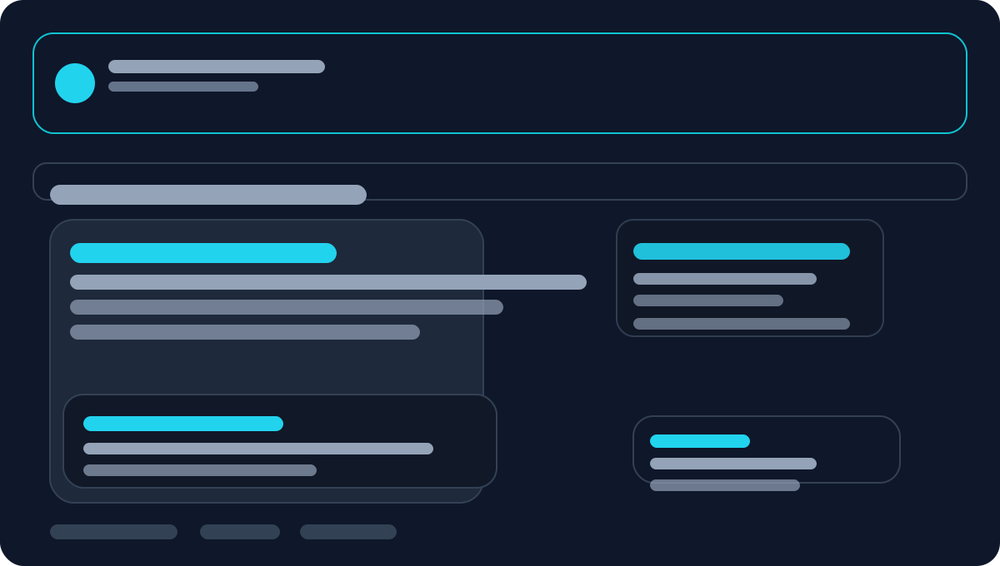

# SIMRS Cendana - Hospital Management Information System

SIMRS Cendana is a comprehensive Hospital Management Information System solution with 24 integrated modules.

## Key Features

### Header/Menu
- Legal Products
- INAPROC Data Dashboard
- Help Center
- News
- Online Store
- INAPROC Electronic Catalog
- Categories
- Search bar: Search products...

### System Modules (24 Modules)

1. **Admission / Registration** - AdmissionRegistration module
2. **Online Registration**
3. **Self-Service Queue System + 1 Kiosk Machine**
4. **Medical Records and Reporting**
5. **Electronic Medical Records**
6. **Outpatient**
7. **Emergency Room**
8. **Inpatient**
9. **Intensive Care**
10. **Medical Rehabilitation**
11. **Central Surgery**
12. **Radiology**
13. **Laboratory**
14. **Pharmacy**
15. **Inventory Management**
16. **Billing System**
17. **Executive Dashboard**
18. **HR / Administration**
19. **Accounting**
20. **System Administration**
21. **BPJS Health Integration Module**
22. **INACBG Integration Module**
23. **SATUSEHAT Integration Module**
24. **KEMKES Integration Module (SISRUTE, SIRANAP, SIRS ONLINE)**

## Product Specifications

- **Type**: Standard
- **License Term**: Lifetime
- **Sale Unit**: Package

## Implementation

SIMRS Cendana implementation is carried out over 12 months (onsite & online/remote) with expert personnel and functional support.

## Technology

- **Framework**: Laravel 13
- **PHP version**: ^8.3
- **Frontend**: Vue 3 + Inertia.js
- **Bundler**: Vite
- **CSS / UI**: Tailwind CSS
- **Database**: MySQL / PostgreSQL
- **Authentication**: Laravel Jetstream & Fortify
- **API / SPA**: Laravel Sanctum + Inertia
- **Modular Architecture**: Laravel Modules (nwidart)

## Installation

1. Clone the repository
2. Run `composer install`
3. Copy `.env.example` to `.env` and configure it
4. Run `php artisan key:generate`
5. Run `php artisan migrate`
6. Run `npm install && npm run build`
7. Run `php artisan serve`

## Homepage Screenshot

## License

This repository is licensed by permission of the project owner. For license inquiries or usage approval, contact [sofiullah.work@gmail.com](mailto:sofiullah.work@gmail.com).

## Security Vulnerabilities

If you discover a security vulnerability within this project, please send an email to [sofiullah.work@gmail.com](mailto:sofiullah.work@gmail.com). All security issues will be promptly addressed.

## Third-Party License

The Laravel framework is open-sourced software licensed under the [MIT license](https://opensource.org/licenses/MIT).
